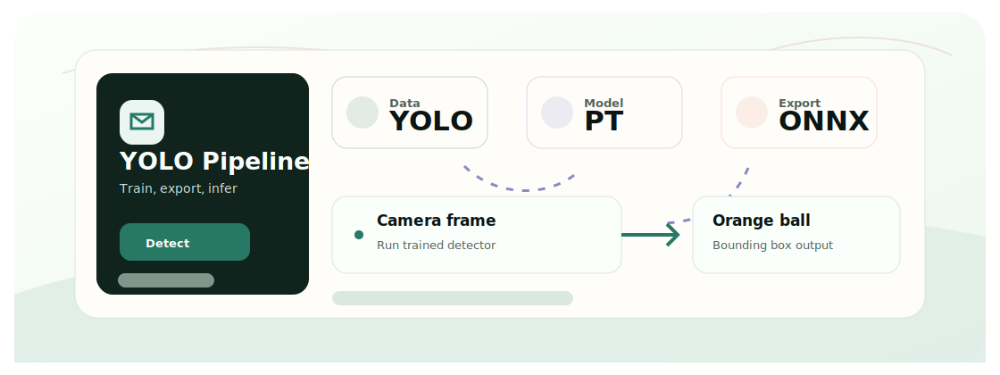
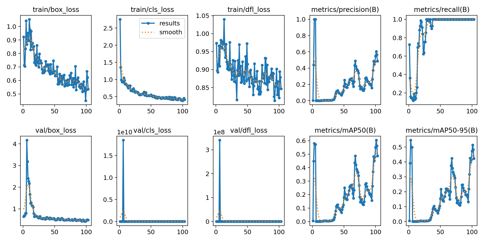
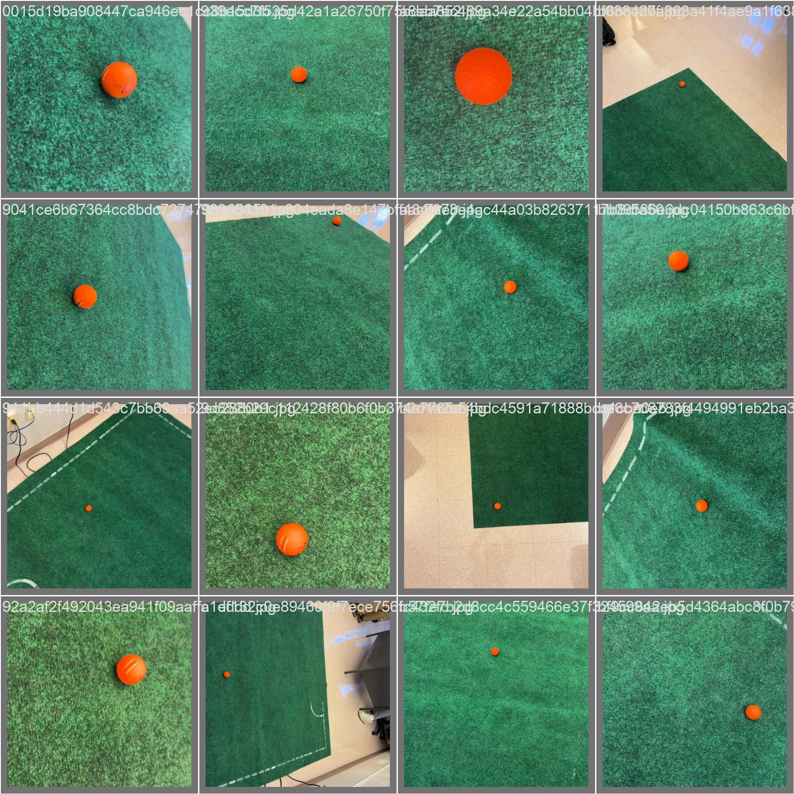

<div align="center">
  <h1>YOLO Orange Ball Detection</h1>
  <p>用于橙色球目标检测的 YOLO 训练与推理实验，包含数据集、模型权重和摄像头脚本。</p>

  <p>
    <a href="README.md">English</a>
    &middot;
    <a href="#快速开始">快速开始</a>
    &middot;
    <a href="#技术栈">技术栈</a>
  </p>

  <p>
    
    
    
  </p>
</div>

<p align="center">
  
</p>

<p align="center">
  
  
</p>

## 项目价值

颜色阈值检测很有用，但学习式检测更能适应光照、背景和相机角度变化。本仓库把橙色球检测的数据集、训练脚本、模型权重和推理工具放在一起。

## 工作流

- 准备 YOLO 格式的彩色或灰度数据集。
- 使用 Ultralytics 脚本训练小型 YOLO 模型。
- 用训练好的权重进行摄像头、视频或数据集推理。
- 导出 ONNX 以便进行轻量运行时实验。
- 使用 ESP32-S3 摄像头串口脚本做嵌入式采集测试。

## 核心功能

- YOLO 格式数据集和训练权重。
- 训练、摄像头、视频、ONNX 导出和 ONNX 推理脚本。
- 随实验保存验证指标和预测图片。
- 用于硬件侧采集的 ESP32-S3 摄像头串口实验。

## 快速开始

```bash
git clone https://github.com/Ha22yX/Yolo-Orange-Ball-detection.git
cd Yolo-Orange-Ball-detection
pip install ultralytics opencv-python onnxruntime numpy pillow pyserial
python Tarining/scripts/webcam_detect.py --weights Tarining/runs/yolo11n-rpi-416/weights/best.pt --cam 0
```

目录名 `Tarining` 保持原样，因为已有实验路径依赖它。

## 技术栈

| 层级 | 技术 | 作用 |
| --- | --- | --- |
| 模型 | YOLO / Ultralytics | 训练和检测脚本。 |
| 推理 | OpenCV, ONNX Runtime | 摄像头/视频推理和导出模型测试。 |
| 数据 | YOLO dataset format | 图像、标签和 data.yaml 文件。 |
| 嵌入式 | ESP32-S3 camera | 串口图像实验。 |

## 项目结构

```text
Tarining/scripts/              training, inference, export, and serial tools
Tarining/yolo-data/            YOLO-format dataset
Tarining/runs/yolo11n-rpi-416/ experiment outputs and weights
arduino/                       ESP32-S3 camera serial sketch
```

## 项目说明

数据集和模型文件保留在仓库中以便复现实验。后续更大的数据集建议放到 Releases 或外部存储。
